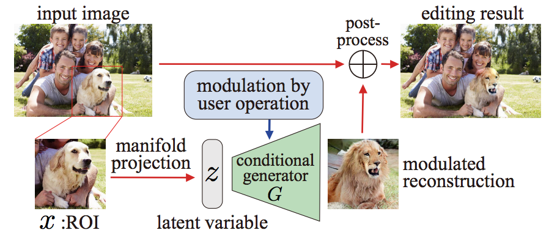
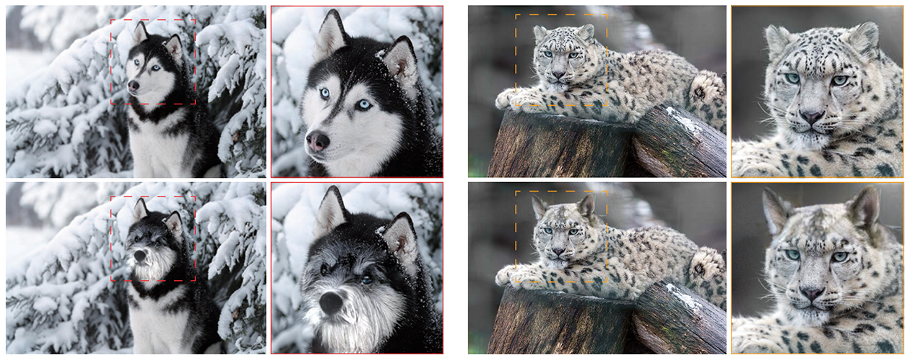
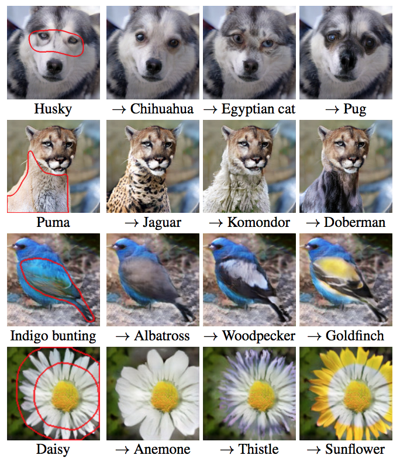
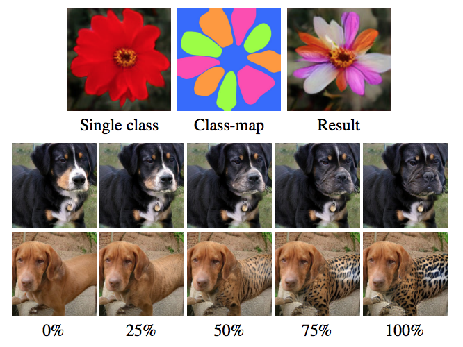
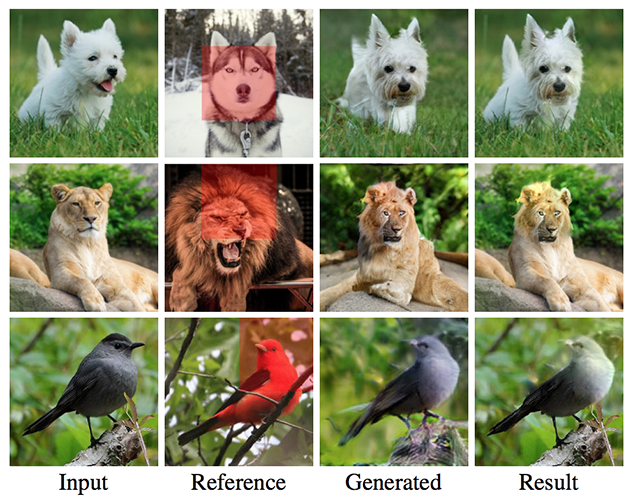
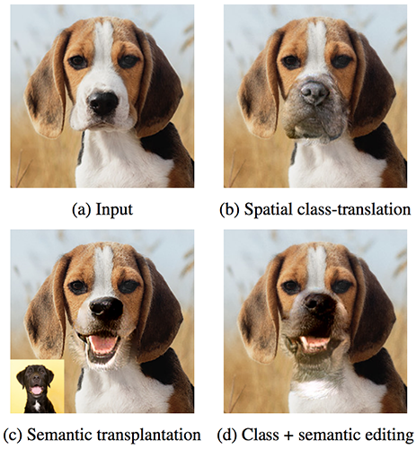
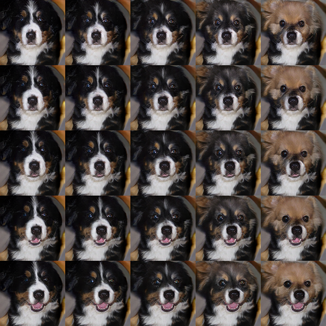
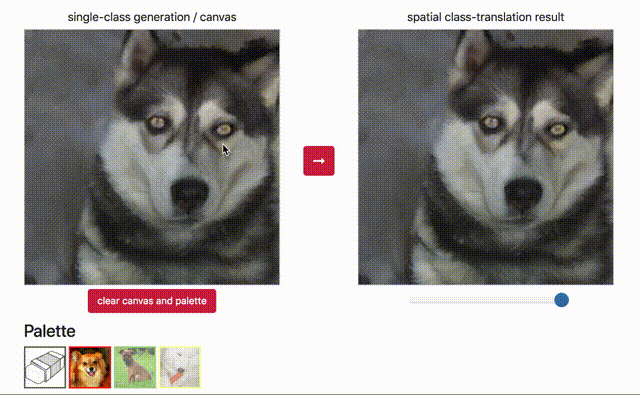

# Neural Collage
### [arXiv preprint](https://arxiv.org/abs/1811.10153)

Chainer implementation of our novel CNN-based image editing method that allows the user to change the semantic information of an image over a user-specified region:

**[Collaging on Internal Representations: An Intuitive Approach for Semantic Transfiguration](https://arxiv.org/abs/1811.10153)**

[Ryohei Suzuki](http://tealang.info/)<sup>1,2*</sup>, Masanori Koyama<sup>2</sup>, [Takeru Miyato](https://takerum.github.io/)<sup>2</sup>, Taizan Yonetsuji<sup>2</sup>  
 <sup>1</sup>The University of Tokyo,
 <sup>2</sup>Preferred Networks, Inc.,<br/>
 <sup>*</sup>This work was done when the author was at Preferred Networks, Inc.<br/>
 arXiv:1811.10153
  
  
## Colab examples
 
- [**Image Editing Workflow**](https://colab.research.google.com/github/quolc/neural-collage/blob/master/NeuralCollage_demo.ipynb)


## Collage-based image editing

### Image editing pipeline

<p align='center'>
  
</p>

### Spatial class-translation

Image editing results using spatial class-translation:
<p align='center'>
  
</p>

Spatially-modulated image generation results:
<p align='center'>
  
  &nbsp;&nbsp;&nbsp;&nbsp;
  
</p>

### Semantic transplantation

Image editing results using semantic transplantation:
<p align='center'>
  
</p>

### Spatial class + semantic transfiguration

Left: example image editing result with spatial class-translation + semantic transplantation.
<br>Right: image generation with spatial 
class (horizontal) + semantic (vertical) morphing.

<p align='center'>
  
  &nbsp;&nbsp;&nbsp;&nbsp;
  
</p>

## Setup

### Prerequisites

- Python >= 3.6

### Install required python libraries:
```bash
pip install -r requirements.txt
```

### Pre-trained models

If you want to use pretrained models for the image generation, please download the model from link and set the snapshot argument to the path to the downloaded pretrained model file (.npz).

- 256x256 ImageNet Dog and Cat Images
  - [Generator and Discriminator](https://drive.google.com/drive/u/0/folders/1SFmq9LjEkIXXAKo6p-Wdlfu0BUFSyLJi)
  - [Encoder and Auxiliary Network](https://drive.google.com/drive/folders/1qPP2RxMNnPSbacotnG7_H5dZrQpOmI3D?usp=sharing)

 
## Web-based demos

### Spatial class-translation
 
<p align='center'>
  
</p>

```bash
# launch server on localhost:5000
python demo_spatial_translation.py \
--config ./configs/sn_projection_dog_and_cat_256_scbn.yml \
--gen_model ./sn_projection_dog_and_cat_256/ResNetGenerator_450000.npz \
--gpu 0
```
 
### Semantic transplantation
 
<p align='center'>
  
</p>

```bash
# launch server on localhost:5000
python demo_feature_blending.py \
--config ./configs/sn_projection_dog_and_cat_256_scbn.yml \
--gen_model ./sn_projection_dog_and_cat_256/ResNetGenerator_450000.npz \
--gpu 0
```

## Advanced Features and Training

Please go to [this link](README_advanced.md).
