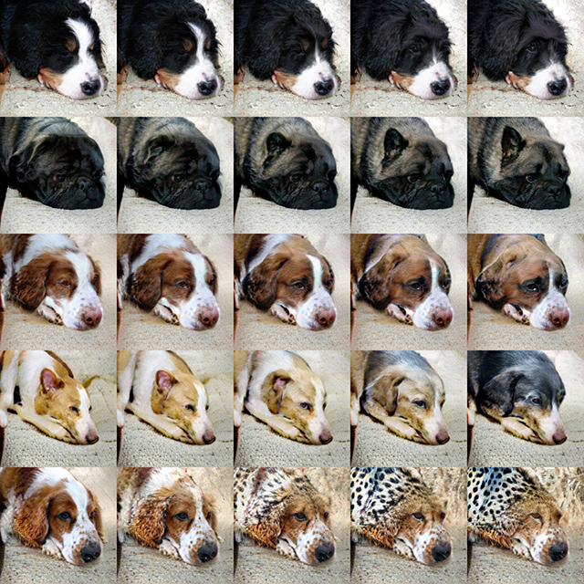

## Running individual scripts

### Manifold projection (calculate z from image)
For the best performance, using trained  encoder+auxiliary net is recommended.

```bash
# Use trained encoder+auxiliary network
python optimization.py \
--config_path ./configs/sn_projection_dog_and_cat_256_auxab.yml \
--gpu 0 \
--gen_model /path/to/ResNetAuxABGenerator_******.npz \
--dis_model ./sn_projection_dog_and_cat_256/SNResNetProjectionDiscriminator_450000.npz \
--enc_model /path/to/ResNetEncoder_******.npz \
--src_class 138 \
--input input.png \
--mode aux
```

Manifold projection can also be performed without auxiliary network.

```bash
# Use trained encoder without auxiliary network
python optimization.py \
--config_path ./configs/sn_projection_dog_and_cat_128_to_256_enc.yml \
--gpu 0 \
--gen_model ./sn_projection_dog_and_cat_256/ResNetGenerator_450000.npz \
--dis_model ./sn_projection_dog_and_cat_256/SNResNetProjectionDiscriminator_450000.npz \
--enc_model /path/to/ResNetEncoder_******.npz \
--src_class 138 \
--input input.png \
--mode noaux
```

As a minimum setup, only G+D are needed for manifold projection, but frequently fall into local minima.

```bash
# Use only generator + discriminator
python optimization.py \
--config_path ./configs/sn_projection_dog_and_cat_128_to_256_enc.yml \
--gpu 0 \
--gen_model ./sn_projection_dog_and_cat_256/ResNetGenerator_450000.npz \
--dis_model ./sn_projection_dog_and_cat_256/SNResNetProjectionDiscriminator_450000.npz \
--src_class 138 \
--input input.png \
--mode noaux
--noenc
```

### Spatial class-translation

```bash
python evaluations/gen_spatially_interpolated_images.py \
--gpu 0 \
--config ./configs/sn_projection_dog_and_cat_256_scbn.yml \
--snapshot sn_projection_dog_and_cat_256/ResNetGenerator_450000.npz \
--results_dir log/gen_spatially_interpolated_images \
--z_file ./examples/z-example_1.npy \
--class_mask ./examples/mask_1.png
```

Example output:

<p align='center'>
  
</p>

### Feature blending with spatial class-translation

```bash
python gen_spatially_interpolated_images_with_feature_blend.py \
--gpu 0 \
--config ./configs/sn_projection_dog_and_cat_256_scbn.yml \
--snapshot sn_projection_dog_and_cat_256/ResNetGenerator_450000.npz \
--results_dir log/gen_spatially_interpolated_images_with_feature_blend \
--z1 ./examples/z-example_2.npy \
--z2 ./examples/z-example_3.npy \
--class_mask ./examples/mask_1.png \
--classes 88 108
```

Example output:

<p align='center'>
  
</p>


## Setup for training

### Download ImageNet dataset:
If you want to train the networks using ImageNet dataset, please download ILSVRC2012 dataset from http://image-net.org/download-images

### Preprocess dataset:
```bash
cd datasets
IMAGENET_TRAIN_DIR=/path/to/imagenet/train/ # path to the parent directory of category directories named "n0*******".
PREPROCESSED_DATA_DIR=/path/to/save_dir/
bash preprocess.sh $IMAGENET_TRAIN_DIR $PREPROCESSED_DATA_DIR
# Make the list of image-label pairs for all images (1000 categories, 1281167 images).
python imagenet.py $PREPROCESSED_DATA_DIR
# Make the list of image-label pairs for dog and cat images (143 categories, 180373 images). 
python imagenet_dog_and_cat.py $PREPROCESSED_DATA_DIR
```

## Training examples

### Generator + Discriminator (GAN)

Please see the README of [snGAN-projection](https://github.com/pfnet-research/sngan_projection) repository for the detailed information.

```bash
python train_GAN.py \
--config_path configs/sn_projection_dog_and_cat.yml \
--gpu 0 \
--data_dir $PREPROCESSED_DATA_DIR \
--results_dir $LOGDIR
```
 
### Encoder

```bash
python train_enc.py \
--config_path ./configs/sn_projection_dog_and_cat_enc.yml \
--gpu 0 \
--input_dir $PREPROCESSED_DATA_DIR \
--truth_dir $PREPROCESSED_DATA_DIR \
--results_dir $LOGDIR \
--gen_model ./sn_projection_dog_and_cat_128/ResNetGenerator_450000.npz \
--dis_model ./sn_projection_dog_and_cat_128/SNResNetProjectionDiscriminator_450000.npz
```

### Auxiliary Network

```bash
python train_auxab.py \
--config_path ./configs/sn_projection_dog_and_cat_auxab.yml \
--gpu 0 \
--input_dir $PREPROCESSED_DATA_DIR \
--truth_dir $PREPROCESSED_DATA_DIR \
--results_dir $LOGDIR \
--gen_model ./sn_projection_dog_and_cat_128/ResNetGenerator_450000.npz \
--dis_model ./sn_projection_dog_and_cat_128/SNResNetProjectionDiscriminator_450000.npz \
--enc_model /path/to/ResNetEncoder_******.npz
```
